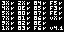
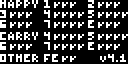
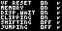
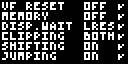
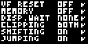
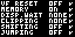

# Chirp8

Chip-8 emulator library written in Rust.

This crate can be used to emulate Original Chip-8 interpreter,
Super-Chip interpreter, and XO-Chip interpreters, depending on how it is
initialized. The number of instructions per frame is customizable as well.

All chip-8 "quirks" are implemented in the available modes, but it is also
possible to create an emulator with only some specified quirks. 

The library is compatible with `no_std` environments and can be used to create
handheld consoles on micro-controllers !

## Examples

- `minimal.rs` : Provides the bare minimum to use this library.
    Very suitable for embedded projects.
- `with_piston.rs` : An example of desktop application using the
    `piston` library to run your favorite chip-8 games on your computer.
- `with_macroquad` : An example of desktop application using `macroquad`
    to render and process keyboard inputs.
- `with_bevy` : An example of desktop application using `bevy` to render and
    process keyboard inputs. This is the only example where sound is actually
    played.

All these example except `minimal` are called as follow :
```sh
cargo run --release --example EXAMPLE -- ROM_PATH [OPTIONS]
```

Where `[OPTIONS]` can be :
- `-c` or `--chip` : Behave as the original Chip-8 interpreter (default).
- `-s` or `--super-chip` : Behave as the Super-Chip interpreter version 1.1.
- `-m` or `--modern-super-chip` : Behave as the modernized Super-Chip interpreter that many rom expect. 
- `-x` or `--xo-chip` : Use XO-Chip behavior.
- `-a` or `--azerty` : to  use Azerty keyboard layout instead of Qwerty.
- `--speed VALUE` : Number of emulator steps per frame.

On linux, `libasound2-dev` is needed to compile these examples, and can be installed as follow :
```sh
sudo apt install libasound2-dev
```

## Crate features

| **Feature name** | **Description**                                                                                       | **Default-enabled** |
| :--------------: | :---------------------------------------------------------------------------------------------------- | :-----------------: |
|     `alloc`      | Allocates the objects that use the most memory on the heap (`Vec<T>`) instead of the stack (`[T; N]`) |         yes         |
|   `mem_extend`   | Extends the emulator RAM size that grows from 4kb to 64kb, stack or heap depends on `alloc`           |         yes         |
|      `std`       | Enables few additional features such as printing when an unknown instruction is encountered.          |         yes         |

## Testing

This library uses [Timendus' tests suite](https://github.com/Timendus/chip8-test-suite.git) as a git submodule,
and passes all of these tests. The process is automated running `cargo test`.
Every test rom is run for some amount of time, and the screen buffer is then
compared to some expected output (see screenshots in `tests/`).
This is only needed if you wish to contribute to this library.
Please run the following to pull the submodules :

```sh
git submodule update --init --recursive
```

|                   **Test**                   |                    **Output**                     |
| :------------------------------------------: | :-----------------------------------------------: |
|              `1-chip8-logo.ch8`              |                |
|               `2-ibm-logo.ch8`               |                  |
|                `3-corax+.ch8`                |                    |
|                `4-flags.ch8`                 |                     |
|        `5-quirks.ch8` in Chip-8 mode         |              |
|      `5-quirks.ch8` in Super-Chip mode       |  |
|   `5-quirks.ch8` in modern Super-Chip mode   |  |
|        `5-quirks.ch8` in XO-Chip mode        |            |
|      `6-keypad.ch8` Only testing 0xFX0A      |               |
|        `8-scrolling.ch8` in high-res         |           |
|         `8-scrolling.ch8` in low-res         |           |
| `8-scrolling.ch8` in high-res (XO-Chip mode) |   |
| `8-scrolling.ch8` in low-res (XO-Chip mode)  |   |
